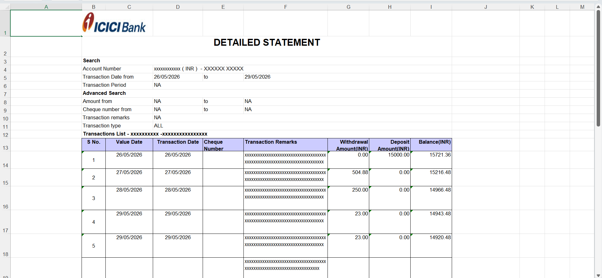
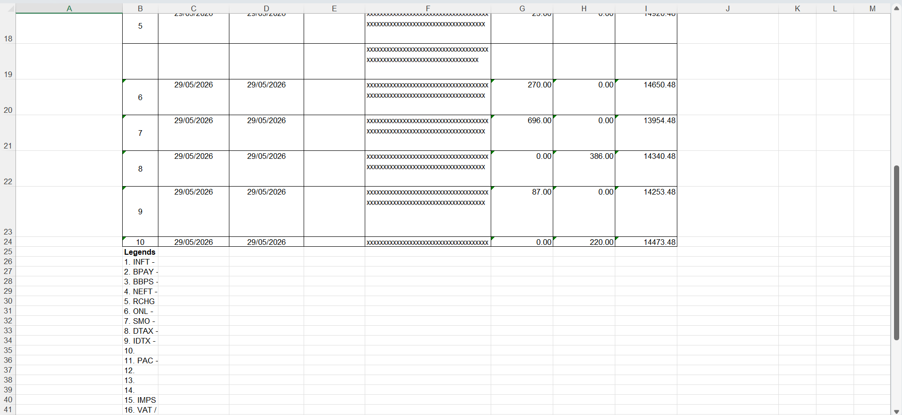
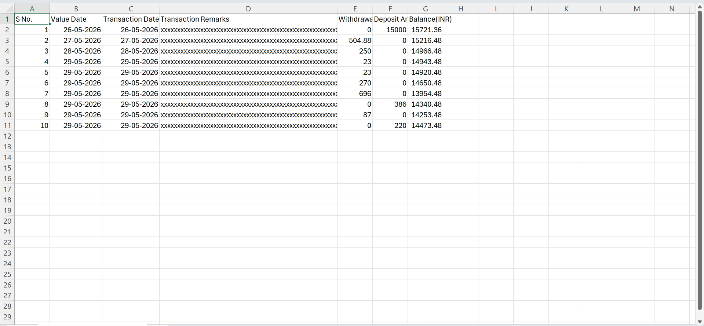
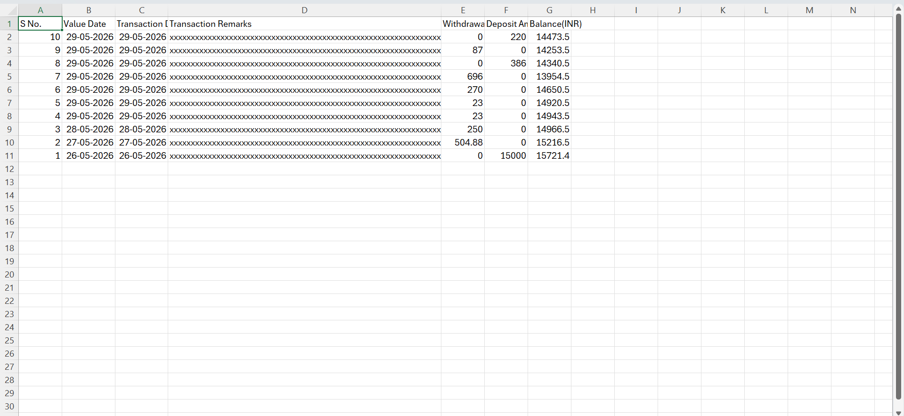

## Bank Statement Cleaner

A simple Python CLI tool that cleans messy `.xls` and `.xlsx` bank statement exports and converts them into a clean CSV file ready for import into Actual Budget.

## Features

* Supports `.xls` and `.xlsx` bank statement files
* Automatically removes unnecessary headers and metadata
* Cleans footer information and trailing notes
* Normalizes transaction tables
* Optional transaction order reversal
* Exports clean UTF-8 CSV files
* Designed to be resilient to minor bank statement format changes

## Setup

### 1. Clone the repository

```bash
git clone https://github.com/AgreeableAK/bank-statement-cleaner.git
cd bank-statement-cleaner
```

### 2. Install dependencies

```bash
pip install -r requirements.txt
```

## Usage

Run the script and provide the path to your bank statement file:

```bash
python statement_cleaner.py -i "path/to/statement.xls"
```

### Reverse Transaction Order

If your statement is exported in reverse chronological order and you want the output sorted from oldest to newest:

```bash
python statement_cleaner.py -i "path/to/statement.xls" -r
```

## Command Line Options

| Option            | Description                                |
| ----------------- | ------------------------------------------ |
| `-i`, `--input`   | Path to the input `.xls` or `.xlsx` file   |
| `-r`, `--reverse` | Reverse transaction order before exporting |

## Output

The script automatically creates a cleaned CSV file in the same directory as the source file.

Example:

Input:

<p align="center">
  
</p>
<p align="center">
  
</p>

Output:
Without "-r" parameter.
<p align="center">
  
</p>

With "-r" Parameter.
<p align="center">
  
</p>

## Project Goal

This project is intended to be a reusable and bank-agnostic statement cleaning utility that prepares transaction data for budgeting tools such as Actual Budget.
